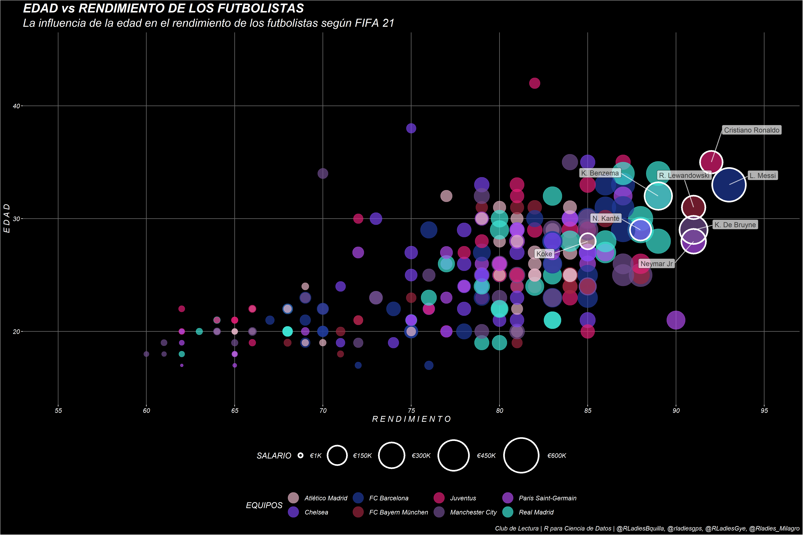

# Capítulo 28: Comunicar con gráficos

Meetup del capítulo 28 "Comunicar con gráficos" del libro R4DS desarrollado el 19 de agosto del 2021 en colaboración con los capítulos RLadies Guayaquil, Galápagos, Milagro y Barranquilla.

[Código](https://github.com/lindajzmin/28_comunicar_con_graficos/blob/main/codigo_grafica.R)
[Slides](https://github.com/lindajzmin/28_comunicar_con_graficos/blob/main/presentacion_cap28.pdf)
[Sesión grabada](https://youtu.be/ySp86powOIw)

### Instructora
Linda Cabrera Orellana - RLadies Guayaquil

### Gráfica

