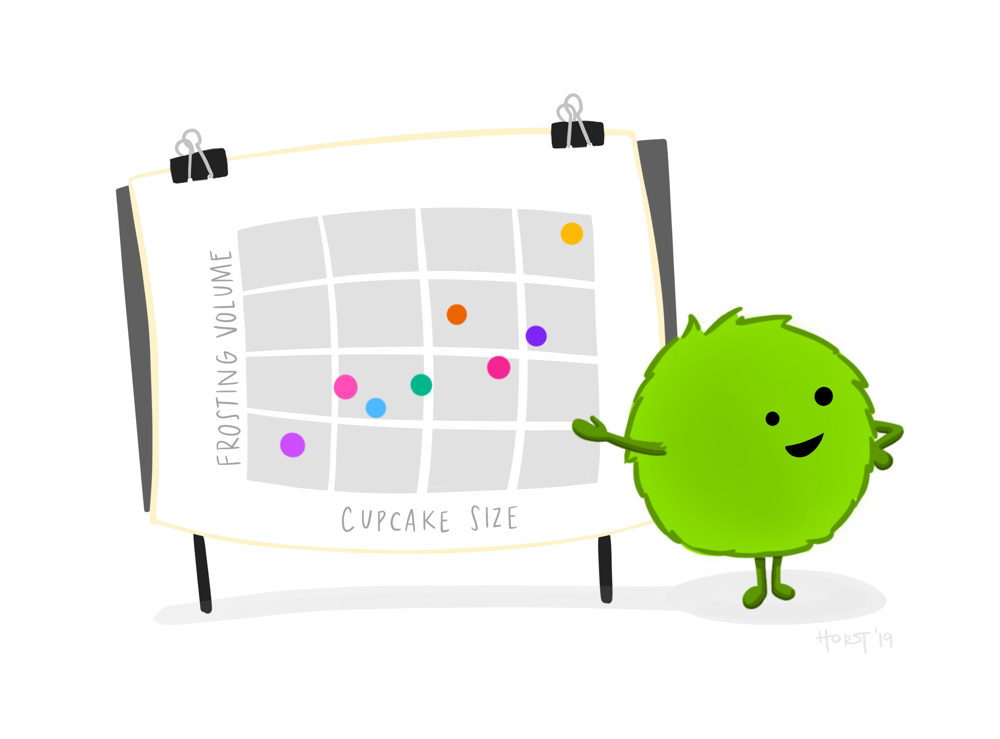

```{r setup, include=FALSE}
options(htmltools.dir.version = FALSE)
```

class: inverse, middle, center

# R-Ladies Global


.pull-left[

<br />
<br />
<br />

La comunidad R sufre de una representación insuficiente de los géneros minoritarios en todos los roles y áreas de participación, ya sea como líderes, desarrolladores de paquetes, conferencistas, participantes de la conferencia, educadores o usuarios (ver estadísticas recientes).

]


.pull-right[

Gabriela de Queiroz - Fundadora de R-Ladies Global]

---

# Código de Conducta

<br />


---

background-image: url("img/rladies.png")
background-size: cover

---

background-image: url("img/rfds.png")
background-size: cover

# Bienvenidos

.pull-right[

<br /> 
<br /> 
<br /> 
<br /> 
<br /> 

**Capítulo 28: Comunicar con Gráficos**

`r icons::fontawesome("book", style = "solid")` <https://es.r4ds.hadley.nz/index.html>

]

---


# Sobre mí

.pull-left[

]

.pull-right[

<br /> 

**Linda Cabrera Orellana**

* Ingeniera en Auditoría
* Máster en Investigación Matemática
* Me dedico a la docencia

`r icons::fontawesome("envelope", style = "solid")` lindaj.cabrera@gmail.com
`r icons::fontawesome("twitter")` lindajzmin
`r icons::fontawesome("github")` lindajzmin


]

---


# Capítulo 28: Comunicar con gráficos


.pull-left[

<br /> 
<br /> 

* Etiquetas o Leyendas

* Anotaciones

* Escalas

* Personalizar los gráficos con _themes_ 

* ¿Cómo guardar un gráfico?
]


.pull-left[

```{r echo=FALSE, fig.height=7}

```
_Artwork by @allison_horst_

]


---

class: inverse, middle, center

# Paquetes


---


# ggplot2()

.pull-left[

- **ggplot2:** Es un paquete de visualización de datos para el lenguaje R que implementa lo que se conoce como la “Gramática de los Gráficos”, que no es más que una representación esquemática y en capas de lo que se dibuja en dichos gráficos.

- <https://cran.r-project.org/web/packages/ggplot2/ggplot2.pdf>

- geom_point()
- theme()
- labs()
- guides()
- scale_*_continuous()
- scale_colour_brewer()
- scale_*_manual()
- scale_size()
]


.pull-right[

_Artwork by @allison_horst_]

---

# ggrepel()

.pull-left[

- **ggrepel:** Proporciona formas de texto y etiquetas para 'ggplot2' que ayudan a evitar la superposición de etiquetas de texto. Las etiquetas se repelen entre sí y lejos de los puntos de datos.

- <https://cran.r-project.org/web/packages/ggrepel/index.html>

]


.pull-right[

_Artwork by @allison_horst_]

---

class: inverse, middle, center

# Data

---

background-image: url(https://i.ytimg.com/vi/8Q6J7E0FetU/maxresdefault.jpg)
background-size: cover
class: center, center, top

---

# FIFA 21

- Atributos detallados para cada jugador registrado en la última edición de la base de datos de FIFA 21 por Stefano Leone recuperado de [Kaggle](https://www.kaggle.com/stefanoleone992/fifa-21-complete-player-dataset?select=players_21.csv).

<br /> 

```{r, include=FALSE}
library(tidyverse)
library(knitr)


fifa <- read_rds('./data/fifa21a.RDS')

```


```{r, echo = FALSE}
funcion1 <- function(x) data.frame(lapply(x, substr, 1, 5))


fifa[2,c(2:9,11)] %>% kable()
fifa[2,12:20] %>% kable()
fifa[2,21:28] %>% kable()
fifa[2,29:34] %>% kable()
```


---

# FIFA 21


```{r, echo = FALSE}
funcion1 <- function(x) data.frame(lapply(x, substr, 1, 5))

fifa[2,35:40] %>% kable()
fifa[2,41:47] %>% kable()
fifa[2,48:53] %>% kable()
fifa[2,54:63] %>% kable()
fifa[2,64:72] %>% kable()
fifa[2,73:77] %>% kable()


```


---

class: inverse, middle, center

# Taller
## Gráfico 1

---

background-image: url(https://gamingbroadband.com/wp-content/uploads/2021/03/Screenshot-188.png)
background-size: cover
class: center, center, top


```{r, include=FALSE}
library(tidyverse)
library(datos)
library(ggplot2)
library(ggrepel)
library(viridis)
library(extrafont)

mejor_pagado <- fifa %>%
    group_by(Club) %>%
    filter(row_number(desc(Sueldo)) == 1)

```


```{r, echo=FALSE, warning=FALSE, fig.align= 'center', fig.width=15, fig.height=8.5}

ggplot(fifa, aes(y = Edad, x = overall, size = Sueldo/1000)) +
    geom_point(aes(color = Club), alpha= 0.7) +
    geom_point(alpha= 0.7, shape = 21, color = "white", stroke = 2, data = mejor_pagado) +
    #scale_colour_brewer(palette = "Set1") +
    scale_color_manual(values = c(
        "#e6b5c6",
        "#7842ed",
        "#203b9c",
        "#9b253d",
        "#e31e75",
        "#704e8f",
        "#af4beb",
        "#3ee5d6")) +
    scale_size(
        breaks = floor(seq(1, 600, length.out = 5)),
        limits = c(1, 600),
        range = c(2, 25),
        labels = function(x) {
            paste0("€", x, "K")
        }
    ) +
    scale_y_continuous(breaks = seq(10, 50, by = 10), limits = c(16, 42)) +
    scale_x_continuous(breaks = seq(55, 95, by = 5), limits = c(55, 95)) +
    ggrepel::geom_label_repel(aes(label = Nombre_Jugador), size = 4, max.overlaps = Inf, data = mejor_pagado, segment.color = "white", segment.size = 0.7, box.padding = 2) +
    guides(color = guide_legend(override.aes = list(size = 8)),
           fill = guide_legend(override.aes = list(size = 8)),
           size = guide_legend(order = 1)) +
    theme(text = element_text(family = "Arial",
                              face = "italic",
                              colour = "white",
                              size = 13),
          axis.text = element_text(color = "white"),
          axis.ticks = element_line(color = "white"),            #las piquitos en cada axis
          plot.title = element_text(family = "Arial",
                                    face = "bold.italic",
                                    size = 20),
          plot.subtitle = element_text(size = 16),
          plot.background = element_rect(fill = "black"),
          legend.position = "bottom",
          legend.box = "vertical",                #se acomodaron la leyenda de equipos y salarios de forma vertical
          legend.box.background = element_blank(),
          legend.background = element_blank(),
          legend.key = element_rect(fill = "black",
                                    color = "black"),    #key es la base de las circulos de las leyendas
          panel.background = element_rect(fill = "black"),
          panel.grid.major = element_line(colour = "dimgrey"),
          panel.grid.minor = element_blank(),
          plot.caption = element_text(size = 10)) +
    labs(title = "EDAD vs RENDIMIENTO DE LOS FUTBOLISTAS",
         subtitle = "La influencia de la edad en el rendimiento de los futbolistas según FIFA 21",
         caption = "Club de Lectura | R para Ciencia de Datos | @RLadiesBquilla, @rladiesgps, @RLadiesGye, @Rladies_Milagro",
         x = "R E N D I M I E N T O",
         y = "E D A D",
         size = "SALARIO",
         colour = "EQUIPOS")

```


---

# Bibliografía

<br /> 

### [1] Cairo, A. (2016). The truthful art : data, charts, and maps for communication. San Francisco, California: New Riders.

### [2] Wickham, H. (2016). Ggplot2 : elegant graphics for data analysis. Switzerland: Springer.

### [3] [30 días de Gráficos con R](https://github.com/cienciadedatos/datos-de-miercoles/blob/master/30-dias-de-graficos-2020.md#resultados-repositorios-con-el-c%C3%B3digo-generado)

---


.pull-left[
# **¡Gracias!**
<br/>
## R-Ladies ECU-COL

### Promoviendo la diversidad de género en la comunidad de R

#### Barranquilla (COL), Galápagos, Guayaquil y Milagro (ECU) 
#### (¡y a nivel global!)]

.pull-right[
<br/>

<br/>

<br/>
`r icons::fontawesome("twitter")` @RLadiesBquilla 
`r icons::fontawesome("twitter")` @rladiesgps @Rladies_Milagro @RLadiesGye
`r icons::fontawesome("youtube")` R-Ladies Ecuador 
`r icons::fontawesome("youtube")` R-Ladies Barranquilla
]


